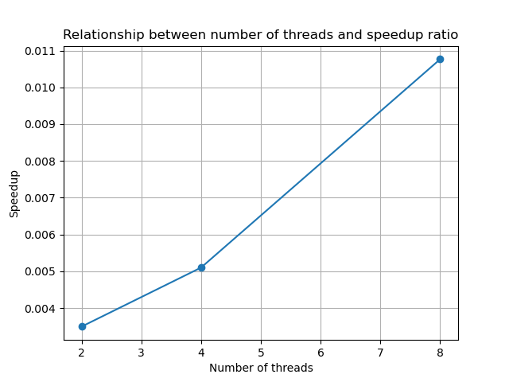

# K-Means Clustering (Parallel Algorithm Project)

## Overview
This project implements the K-Means clustering algorithm in two versions:
1. **Non-parallel version**: A sequential implementation of K-Means.
2. **Parallel version**: Optimized using Python's `multiprocessing` module to parallelize the assignment of clusters.

The goal is to demonstrate the performance improvement achieved through parallelization.

---

## Algorithm and Parallelization Method
### Algorithm
The K-Means clustering algorithm partitions a dataset into `k` clusters by iteratively:
1. Initializing `k` centroids randomly.
2. Assigning each data point to the nearest centroid.
3. Updating the centroids based on the mean of all points in each cluster.
4. Repeating until centroids stabilize or a maximum number of iterations is reached.

### Parallelization
The most time-consuming step, assigning data points to the nearest centroid, is parallelized by:
- Splitting the dataset into chunks.
- Using `multiprocessing.Pool` to compute distances in parallel.

---

## How to Run
### Prerequisites
1. Install Python 3.8+.

### Steps to Execute
1. **Generate Data**:
   Generate a dataset with 70,000 samples:
   ```bash
   python data_utils.py
   ```

2. **Run Non-parallel Version**:
   Execute the sequential implementation:
   ```bash
   python Non_Parallel.py
   ```

3. **Run Parallel Version**:
   Execute the parallel implementation:
   ```bash
   python Parallel.py
   ```

4. **Benchmark Performance**:
   Compare the performance of non-parallel and parallel versions:
   ```bash
   python benchmark.py
   ```

---

## Results
### Performance Comparison
The performance of the non-parallel and parallel versions was measured. Results are as follows:

| Number of Threads | Non-parallel Time (s) | Parallel Time (s) | Speedup |
|-------------------|------------------------|-------------------|---------|
| 1                 | 0.24                  | -                 | -       |
| 2                 | -                     | 69.52             | 0.00    |
| 4                 | -                     | 47.63             | 0.01    |
| 8                 | -                     | 22.56             | 0.01    |

### Speedup Plot
The speedup achieved as the number of threads increases is shown below:



---

## Repository Structure
```
project_root/
├── Non_Parallel.py       # Non-parallel K-Means implementation
├── Parallel.py           # Parallel K-Means implementation
├── data_utils.py         # Data generation and handling
├── benchmark.py          # Performance testing and analysis
├── data/                 # Dataset folder
│   └── dataset.csv       # Generated dataset
├── benchmarks/           # Performance results and plots
│   ├── results.txt       # Benchmark results
│   └── speedup_plot.png  # Speedup graph
├── README.md             # Project documentation
```

---

## Notes
- The dataset was generated using `sklearn.datasets.make_blobs` to simulate clustered data.
- Results may vary depending on hardware and the number of threads used.
- Ensure the `data` folder exists before generating data.

---

